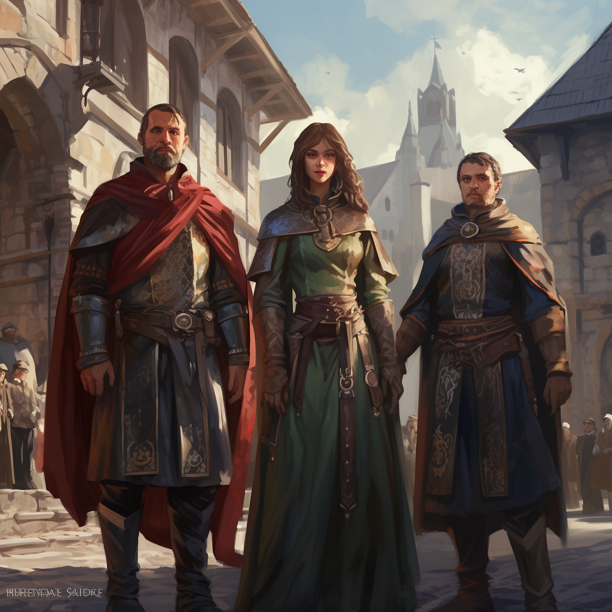
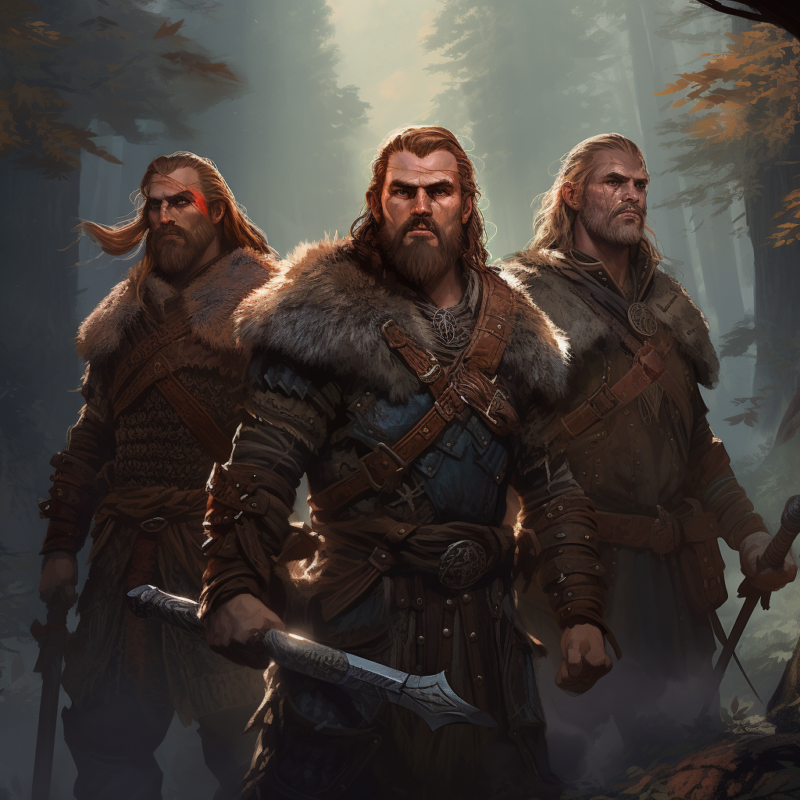
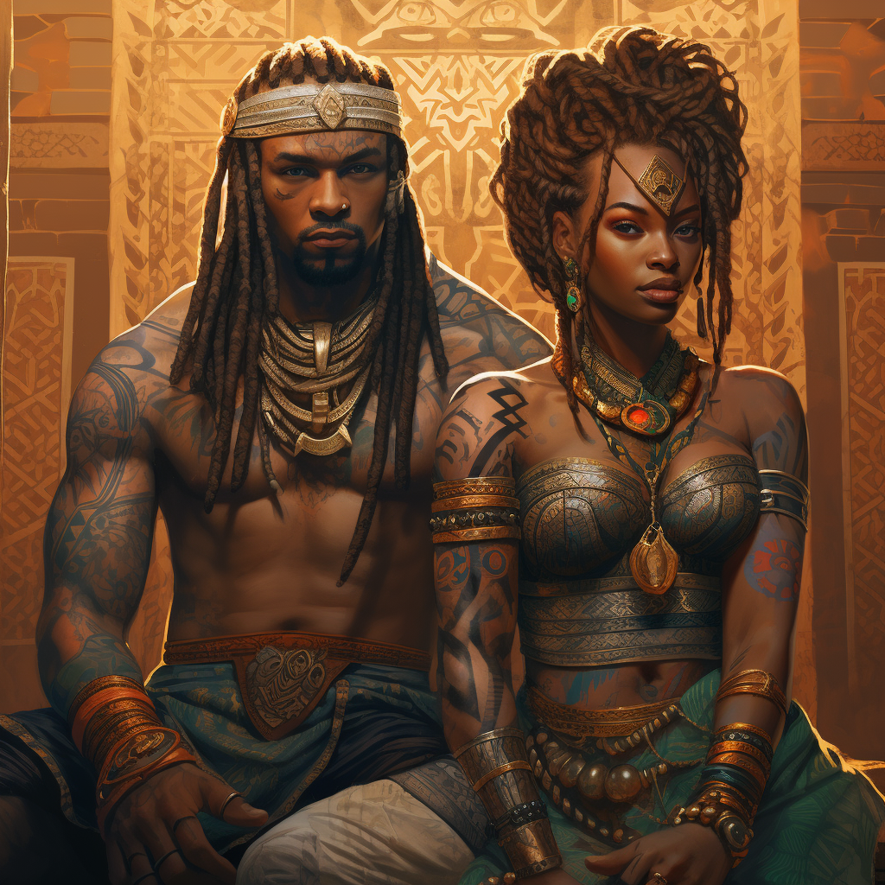
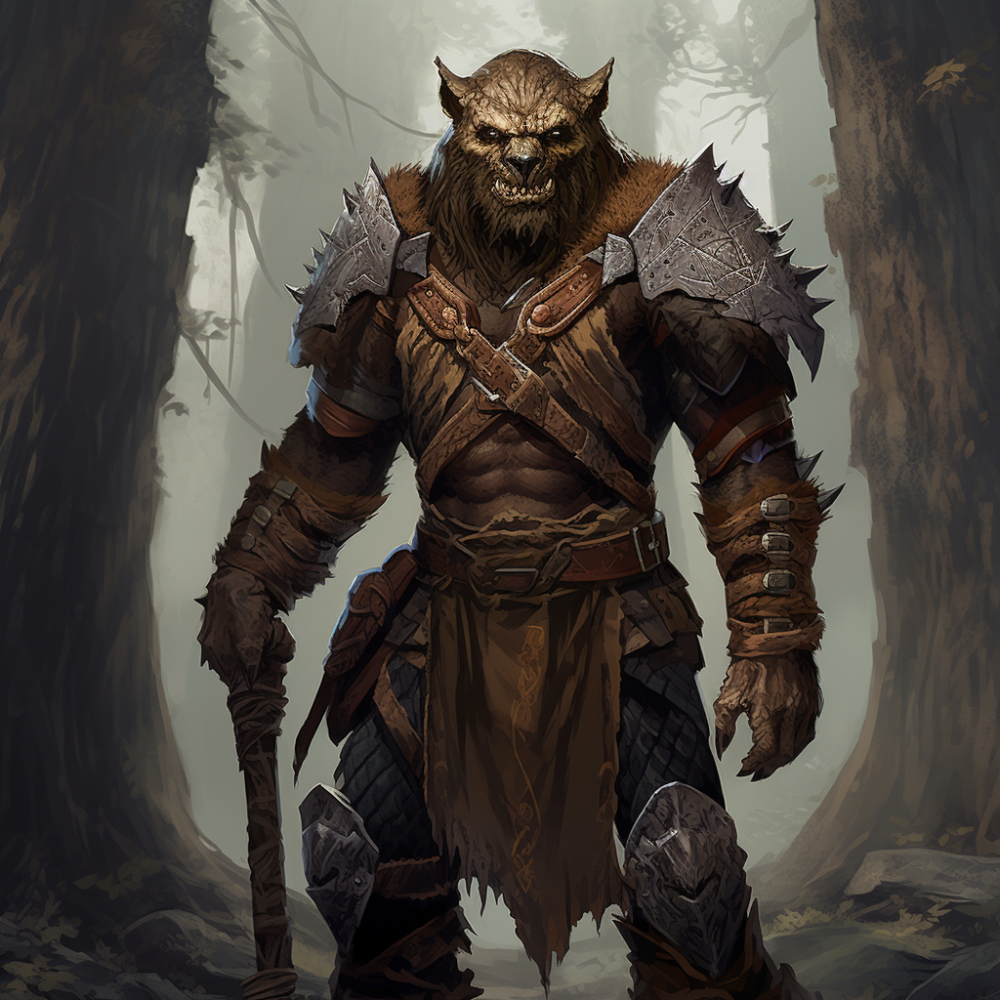
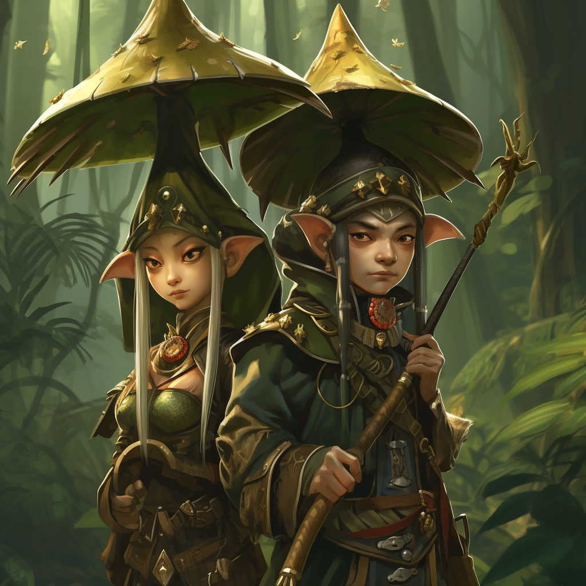
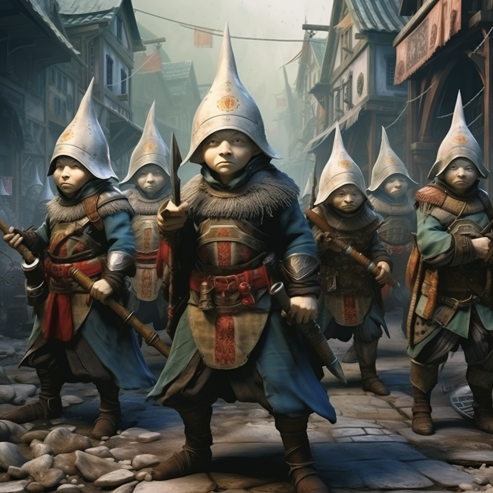
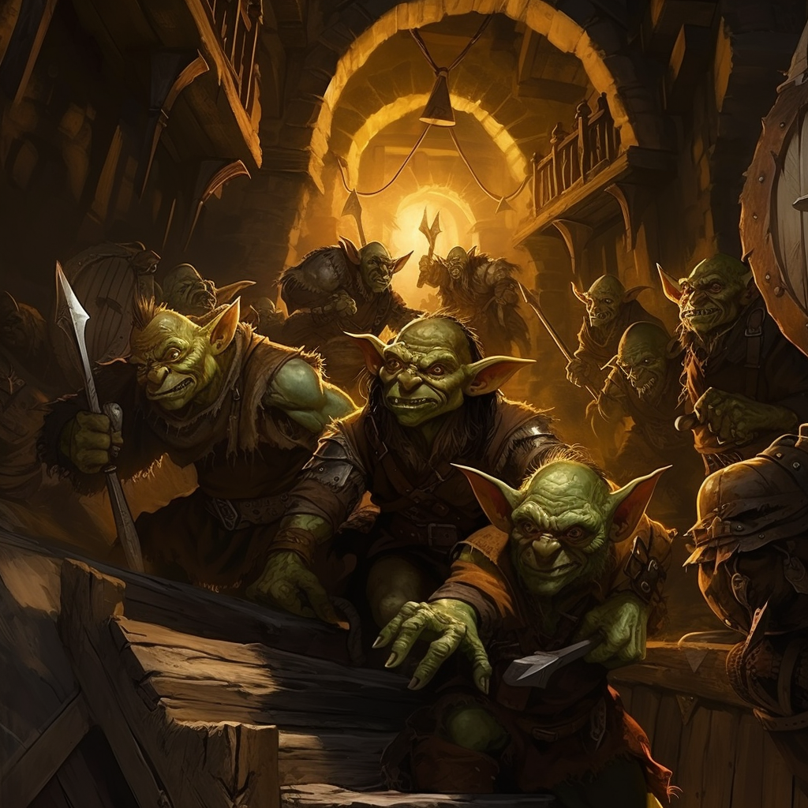

## Rasy

### Lidé

Lidé jsou rasou s rozpínavou myslí a povahou. Tvoří velká společenství, státy a impéria. Lidem je vlastní univerzálnost. Jsou schopni zvládnout téměř jakékoliv strasti a přizpůsobit se takovému životu. Možná ne jako jedinci, ale definitivně jako společnost.

Lidi pohání jejich víra. Víra v ně samotné a víra v instituce. S institucemi jako řády, gildami, církvemi apodobně roste i společnost lidí. Naopak v úpadku těchto institucí mají lidé tendenci vzhlížet k hrdinům, kteří pomohou těmto institucím dosáhnout zpět své zašlé slávy.

#### Populové

Populové jsou nejrozšířenějším lidským rodem a představujou hlavního zástupce lidské rasy.

#### Skalové

Skalové jsou divočinou ošlehaným surovým rodem lidí, který si zvykl na drsný život mimo civilizaci. Tvoří spolu společenství, žijí v klanech, bojují mezi sebou a s přírodou, která je obklopuje či drancují civilizovaná království.

#### Kremeni

jedná se o rasu lidí, kteří si nechali vytetovat magická tetování, do kterých přijali mladého démona. démon jim prodlužuje život a propůjčuje magické schopnosti. Jejich fyziologie se za dlouhou dobu změnila tak, že v dospělosti již nejsou schopni přežít bez démona, který přebývá v jejich kůži. V pubertě každý Kremen projde rituálem Šalma Rý, při kterém jsou mu vytetovány magické runy a jiné obrazce na tělo a do kterých přijme svého démona astrálních sfér.

Této symbiózy využívá jiní démoni astrálních sfér. Říkají si Krelové. Krelové jsou démoni, kteří se umí vtělit do jiné bytosti a naprosto převzít nad ní kontrolu. Díky spojení Kremenů a démonů astrálních sfér mají Krelové nad Kremeni určitou moc a jsou schopni je daleko jednodušeji ovlivňovat. Civilizace Kremenů tak stojí na tom, že uctívají Krely jako bohy a vůdce v jednom. Slouží jim jako jejich věrní posluhovači a bojují za ně ve válkách.

#### Gobři

Gobři jsou magií přetvoření lidé ve velké chlupaté hromotluky s obrovskou silou a skvělou regenerací. Gobrem se může stát jak žena, tak muž, ale přeměna je sterilizuje. Navíc se jim vrátí určité agresivní zvířecí rysy.

Gobři mají po přeměně vymazanou paměť a je potřeba je zase trochu naučit způsobům. Bývají velmi vznětliví, ale dobře vychovaný Gobr může být oddaným přítelem a nebezpečným nepřítelem.

### Skřítci

Skřítci jsou asi poloviční jak lidé. Mají vlasy černých nebo naopak bílých barev a špičaté uši. Oproti lidem mají v poměru k jejich tělu také velmi velké oči, které jim pomáhají s viděním za šera.

Žijí svůj skřítčí život a moc se nezajímají o život mimo jejich území. Věnují se hlavně zvelebováním svého vlastního života a svého nejbližšího okolí. Nejsou velcí kolonialisté, ale vlastní území si brání zuby nehty. Rozhodně se nevzdávají bez boje a když jsou donuceni, vezmou zbraně do jejich malých rukou a bojují s odhodláním jejich vlastním.

Skřítčí společnost je hodně zaměřena na hojnost a rozmanitost potravy. Jíst obyčejný chlép každý den je pro skřítky něco nepředstavitelného a rádi si svá jídla "okořeňují" pro ostatní rasy zvláštními doplňky, jako může být různá šťáva z hmyzu.

Pro ostatní rasy jsou skřítci nejznámější svým smyslem pro různé exotické koření, čaje nebo kávu. Tyto artikly jsou pro skřítčí říše typické a obchod s ostatními národy proto může přímo kvést.

Pro skřítky je důležitá jejich komunita, do které patří. Všichni v komunitě se dobře znají a pro cizince může být těžké, než jim skřítci naplno uvěří. To platí i pro uzavření dohod. Mezi sebou skřítci uzavírají mnoho dohod, ale naprostým cizincům nevěří. Většinu domluv tak musí řešit stařešina, který mluví za celou komunitu.

V době úpadku se skřítci združují v malých komunitách o pár desítkách členech. Tyto komunity mohou být od sebe velmi vzdálené a v dobách největších krizí spolu příliš nekomunikují. Naopak v době rozkvětu a blahobytu mohou skřítci budovat obrovská města, ve kterých je moho komunit - čtvrtí. Každé čtvrti předsedá stařešina a na společných setkáních mluví tito stařešinové za své komunity. Řeší zde spory či pomoc s budováním lepší budoucnosti.

#### Mandi

Mandi jsou skřítci, kteří žijí v soužití s přírodou, která je obklopuje. Využívají jí k budování svých příbytků ...

#### Tonga

Tonga jsou váleční skřítci, pro které je čest vším. Vehementně si brání své věci. ...

#### Goblini

Goblini jsou magií přeměnění zohyzdnění skřítci, jejiž pokroucená mysl dokáže uznávat pouze sílu a krutost. Goblinní mysl je zjednodušena a nedokáží si představit život bez svého krutého pána. Pohání je strach z nesplnění jeho rozkazů a nebojí se jakékoliv špatnosti. Goblin svého pána nesnáší a zároveň ho fanaticky miluje. Goblinem se může magicky stát pouze skřítčí muž. Žena by přeměnu nepřežila. ...

### Garmuni

Jsou hmyzími lidmi, kteří žijí v podzemí a nemají rádi velký chlad. Jsou trochu menší než lidé. Mají rozpínovanou mysl. Speciální vlastností hmyzců je to, že se mohou zakuklit a proměnit své fyzické vlastnosti:

* **Blukr** - S křídly a hbitostí, ale s malou odolností a charismou.

* **Akant** - S přirozenou zbrojí a 4 horníma končetinama, ale s nízkou odolností a charismou.

* **Verx** S velkým mozkem a vysokou inteligencí, ale s nízkou odolností a charismou. Mají přirozenou schopnost kouzlit.

* **Feret** - Infikovaní - Někteří hmyzci se mohou nakazit houbovitou infekcí, která převezme kontrolu nad myslí hmyzců. Mezi hmyzci se infekce přenáší kousnutím. Vždy existuje královna, která potřebuje konzumovat mozky inteligentních bytostí, aby mohla komunikovat s infikovanými hmyzci. Tato královna je mozkem celého hnízda a komunikuje telepaticky se všemi infikovanými (dokud je dostatečně zásobena inteligentními mozky).

### Krelové

Krelové jsou nehmotné entity - démoni astrálních sfér tvoření šedivým světlem. Když nejsou v těle hostitele, jsou schopni přežít v materiální sféře pouze několik hodin.

Jejich přirozeným prostředím jsou jakákoliv místa prosycená magií - ideálně magické bouře.

Krelové jsou schopni se zmocnit hostitele a změnit jeho buněčnou strukturu. Tím mu prodloužit život, dají mu magické schopnosti a jeho fyzické vlastnosti se daleko zlepší. Hostitel však nemá žádnou nadvládu nad svým tělem a musí žít ve svém těle jako vězni. Toto všechno však dokáží pouze dospělí Krelové, kteří jsou staří stovky let.

Mladí Krelové nejsou schopni převzít nadvládu nad cizím tělem, ale jsou schopni žít v symbióze s humanoidní rasou, pokud jsou drženi v horní vrstvě kůže humanoida pomocí magických tetování.

### Elfové

Elfové jsou bytosti ze snové sféry, které zmigrovali do materiální sféry. Rozdělili se na 2 kmeny, které 

* **Moltiran** - Pyšní elfové, kteří se staví nad ostatní národy, jelikož mnoho civilizovaného přinesli právě oni. Jsou mocní a velmi teritoriální, ale neexpanzivní.

* **Ulmenian** - Elfové, kteří se více zaměřili na svůj původní význam. Žijí v harmonii se svým okolím a pomáhají ostatním živočichům v okolí s harmonickým prožíváním snů.

* **Tistar** - Velmi teritoriální a nepřátelští elfové, kteří zasvětili svůj život kočovnému životu v sedle.
